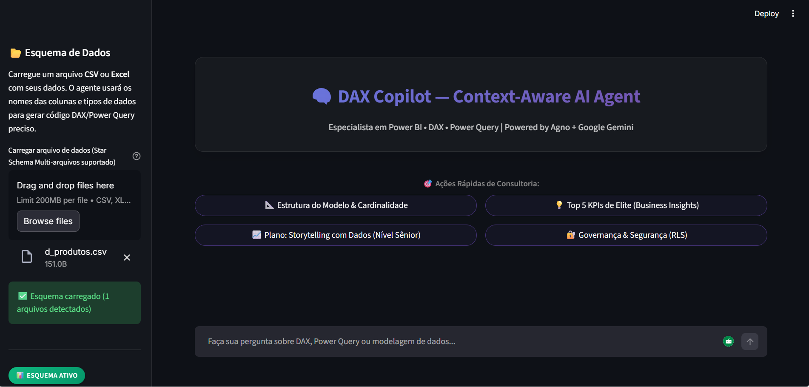

# 🧠 DAX Copilot — Strategic Data Architect & AI Agent

<div align="center">

**Agente de IA Consultor Sênior especialista em Power BI, DAX, Storytelling e Governança**
*Construído com [Agno](https://agno.com) + Google Gemini de Alta Performance*

[](#URL_DO_STREAMLIT_AQUI)
[](#)


<br />



<br />

[Português](#-sobre-o-projeto) · [English](#-about-the-project)

</div>

---

## 🇧🇷 Sobre o Projeto

O **DAX Copilot** é um agente de IA **context-aware** (consciente do contexto) que foi elevado de um simples assistente para um **Arquiteto de Dados Virtual**. Ele não apenas gera código; ele atua como um consultor estratégico que entende o contexto do seu negócio e aplica metodologias de elite para transformar dados em decisões.

Especializado em:
- 📊 **Power BI** — Modelagem dimensional e boas práticas.
- 📐 **DAX** — Medidas otimizadas com variáveis VAR/RETURN.
- 🔄 **Power Query (Linguagem M)** — Transformações de dados eficientes.
- ⭐ **Star Schema** — Modelagem Fato/Dimensão profissional.

### 🔥 Diferenciais Sênior (Modos de Consultoria)

Ao carregar um esquema de dados na nova interface, o Agente oferece 4 caminhos de análise profunda:

1.  📐 **Arquitetura & Star Schema:** Desenha o modelo dimensional completo (Fatos/Dimensões) em **Linguagem M**, definindo cardinalidades (1:*) e chaves PK/FK.
2.  💡 **KPIs de Elite (Business Insights):** Sugere as 5 métricas mais estratégicas do seu setor, entregando código **DAX Avançado** (VAR/RETURN) e impacto no negócio.
3.  📈 **Storytelling com Dados:** Aplica a metodologia de **Cole Nussbaumer Knaflic**, fornecendo planos de visualização, paletas de cores (HEX) e foco de atenção.
4.  🔐 **Governança & Segurança (RLS):** Planeja a segurança de nível de linha para garantir compliance e proteção de dados sensíveis.

### ✨ Funcionalidades
| Feature | Descrição |
|---------|-----------|
| ⚡ **Real-Time Streaming** | Respostas instantâneas sem congelamento da interface. |
| 🧠 **Context-Aware** | Lê seu esquema (CSV/Excel) e usa nomes reais de colunas e tabelas. |
| 🔒 **Fidelidade aos Dados** | NUNCA inventa nomes — usa exatamente o que está no seu arquivo. |
| 📝 **Código Limpo** | Gera DAX/Power Query formatado, indentado e pronto para copiar. |
| 🖥️ **CLI Interativa** | Interface de terminal rica com comandos intuitivos. |
| 🌐 **UI Streamlit** | Interface web moderna com upload de arquivos e chat. |

### 🛡️ Segurança de Dados e Privacidade (Data Privacy by Design)
Um dos pilares deste projeto é a **segurança absoluta dos dados corporativos**. O DAX Copilot possui uma arquitetura *Zero-Data-Leak*:
- **NUNCA lê seus dados reais:** O agente processa **EXCLUSIVAMENTE METADADOS** (nomes das colunas e tipos de dados).
- **Processamento 100% Local (Client-Side):** A ferramenta `parse_schema` extrai apenas os cabeçalhos localmente.
- **Nenhuma linha de fatos ou valores financeiros é enviada para a API da LLM (Google Gemini).**
- Totalmente aderente às políticas de privacidade corporativas e LGPD.

### 🛠️ Stack Tecnológica
| Tecnologia | Papel |
|-----------|-------|
| **[Agno](https://agno.com)** | Framework de orquestração de agentes. |
| **[Google Gemini 3.1 Flash Lite Preview](https://ai.google.dev)** | Modelo de linguagem de última geração. |
| **[Streamlit](https://streamlit.io)** | Interface UI Premium com Glassmorphism. |
| **[uv](https://docs.astral.sh/uv/)** | Gerenciador de pacotes ultrarrápido. |

---

### 🚀 Instalação
**Pré-requisitos:** Python 3.13+ | [uv](https://docs.astral.sh/uv/) instalado | Chave de API do [Google AI Studio](https://aistudio.google.com/apikey).

```bash
# 1. Clone o repositório
git clone https://github.com/leoserpa/dax-copilot-context-aware-ai-agent.git
cd dax-copilot-context-aware-ai-agent

# 2. Instale as dependências
uv sync

# 3. Configure sua API Key (Crie um arquivo .env)
# GOOGLE_API_KEY=sua_chave_aqui

# 4. Execute!
uv run python main.py                       # CLI interativa
uv run streamlit run src/dax_copilot/ui/app.py  # Interface web
```

### 💻 Uso — CLI
```
📌 Comandos disponíveis:
  /schema <caminho>  → Carrega arquivo CSV/Excel como esquema de dados
  /ver               → Mostra o esquema de dados atualmente carregado
  /limpar            → Remove o esquema e reinicia o agente
  /ajuda             → Mostra ajuda
  /sair              → Encerra o programa
```

---

### 📁 Estrutura do Projeto
```
DAX-Copilot-Context-Aware/
├── .env.example          # Template de variáveis de ambiente
├── .gitignore            # Arquivos ignorados pelo Git
├── LICENSE               # ⚖️ Licença MIT
├── pyproject.toml        # Dependências do projeto (uv)
├── README.md             # Esta documentação
│
├── src/dax_copilot/
│   ├── agent/            # 🤖 Núcleo do Agente e Prompts
│   ├── cli/              # 🖥️ Entry point CLI interativa
│   ├── tools/            # 📊 Parser de esquema CSV/Excel
│   └── ui/               # 🌐 Interface Streamlit
│
├── assets/screenshots/   # 📸 Imagens do projeto
└── data/                 # 📄 Dados de exemplo para testes
```

---

## 🇺🇸 About the Project (English Version)

**DAX Copilot** is a **context-aware AI agent** that acts as a **Virtual Data Architect** specialized in:
- 📊 **Power BI** — Dimensional modeling and best practices.
- 📐 **DAX** — Optimized measures with VAR/RETURN variables.
- 🔄 **Power Query (M Language)** — Efficient data transformations.
- ⭐ **Star Schema** — Professional Fact/Dimension modeling.

### 🔥 Senior Pillars (Consulting Modes)
1.  📐 **Architecture & Star Schema:** Designs dimensional models in **M Language**.
2.  💡 **Elite KPIs (Business Insights):** Suggests strategic metrics with **Advanced DAX**.
3.  📈 **Storytelling with Data:** Based on **Cole Nussbaumer Knaflic's** methodology.
4.  🔐 **Governance & Security (RLS):** Plans Row-Level Security and compliance.

### ✨ Technical Features
| Feature | Description |
|---------|-------------|
| ⚡ **Real-Time Streaming** | Instant AI responses without UI freezing. |
| 🧠 **Context-Aware** | Reads your schema (CSV/Excel) and uses real column/table names. |
| 🔒 **Data Fidelity** | NEVER invents names — uses exactly what's in your file. |
| 📝 **Clean Code** | Generates formatted, indented DAX/Power Query code ready to copy. |
| 🖥️ **Interactive CLI** | Rich terminal interface with intuitive commands. |
| 🌐 **Streamlit UI** | Modern web interface with file upload and chat. |

### 🛡️ Data Privacy & Security (Zero-Data-Leak)
A core pillar of this project is the **absolute security of corporate data**. The DAX Copilot was built with a *Zero-Data-Leak* architecture:
- **NEVER reads your actual data:** The agent processes **EXCLUSIVELY METADADOS** (column names and data types).
- **100% Local Processing:** The `parse_schema` tool extracts only the headers locally.
- **No factual rows, financial values, or PII are ever sent to the LLM API (Google Gemini).**
- Fully compliant with corporate privacy policies, GDPR, and LGPD.

### 🛠️ Tech Stack
| Technology | Role |
|-----------|-------|
| **[Agno](https://agno.com)** | AI Agent Orchestration Framework. |
| **[Google Gemini 3.1 Flash Lite Preview](https://ai.google.dev)** | State-of-the-art LLM. |
| **[Streamlit](https://streamlit.io)** | Premium UI Interface with Glassmorphism. |
| **[uv](https://docs.astral.sh/uv/)** | Ultra-fast package manager. |

---

### 🚀 Quick Start
**Prerequisites:** Python 3.13+ | [uv](https://docs.astral.sh/uv/) installed | [Google AI Studio](https://aistudio.google.com/apikey) API Key.

```bash
# 1. Clone the repository
git clone https://github.com/leoserpa/dax-copilot-context-aware-ai-agent.git
cd dax-copilot-context-aware-ai-agent

# 2. Install dependencies
uv sync

# 3. Configure your API Key (Create a .env file)
# GOOGLE_API_KEY=your_key_here

# 4. Run it!
uv run python main.py                       # Interactive CLI
uv run streamlit run src/dax_copilot/ui/app.py  # Web interface
```

### 💻 Usage — CLI
```
📌 Available commands:
  /schema <path>     → Loads a CSV/Excel file as a data schema
  /ver               → Shows the currently loaded data schema
  /limpar            → Removes the schema and restarts the agent
  /ajuda             → Shows help
  /sair              → Exits the program
```

---

### 📁 Folder Structure
```
DAX-Copilot-Context-Aware/
├── .env.example          # Environment variables template
├── .gitignore            # Files ignored by Git
├── LICENSE               # ⚖️ MIT License
├── pyproject.toml        # Project dependencies (uv)
├── README.md             # This documentation
│
├── src/dax_copilot/
│   ├── agent/            # 🤖 Agent Core & Prompts
│   ├── cli/              # 🖥️ Interactive CLI entry point
│   ├── tools/            # 📊 CSV/Excel schema parser
│   └── ui/               # 🌐 Streamlit Interface
│
└── assets/screenshots/   # 📸 Project images
```

---

## 📄 Licença / License

Este projeto é distribuído sob a licença MIT. Veja o arquivo `LICENSE` para mais detalhes.

This project is distributed under the MIT License. See `LICENSE` for details.

---

<div align="center">
<sub>Feito com 💜 por Leonardo Serpa — Powered by Agno + Google Gemini 3.1 Flash Lite Preview</sub>
</div>
